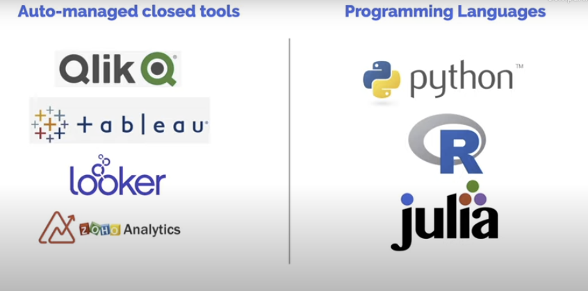
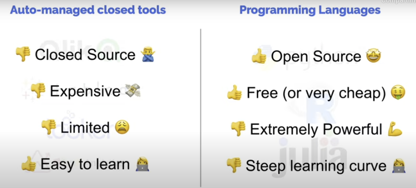

# What its data analysis

> Process of inspecting, cleanning, transforming and modeling data with the goal of discovering useful info, informing a conclusino and suport desision-making

* Pandas
    * Its a tool to read, clean and transform our data
* Seaborn and Matplot
    * Modeling data

> We try to transform _data_ into infomation

The objetive its suport the decision-making

## Tools

## Why python?

* Its simple
* Free and open source
* Powerfull library
* The documentation are big and the suport

---

## Steps - not so step by step?

### Data extracting
* SQL
* Scrapping
* File formats
    * CSV
    * Json
    * XML
* Consulting APIs
* Buying data
* Distributed
* Databases

### Data cleanning
- Missing values and empty data
- Data imputation
- Incorrect types
- Incorrect or invalid values
- Outliers and non-relevant data
- Statistical sanitization

### Data Wragling (Organize data)
- Hierarchical data
- Handling category data
- Reshaping and transforming structure
- Indexing data for quick access
- Merging, combining and joining data

### Analysis
- Explore
- Building static models
- Visualization and representation
- Correlation vs Causation analisys
- Hypothesis testing
- Statical anaysis
- Reporting

### Action
- Building machine learning models
- Feature engineering
- Moving ML into production
- Building ETL pipes
- Live dashboard and reporting
- Decision making and real-life tests
